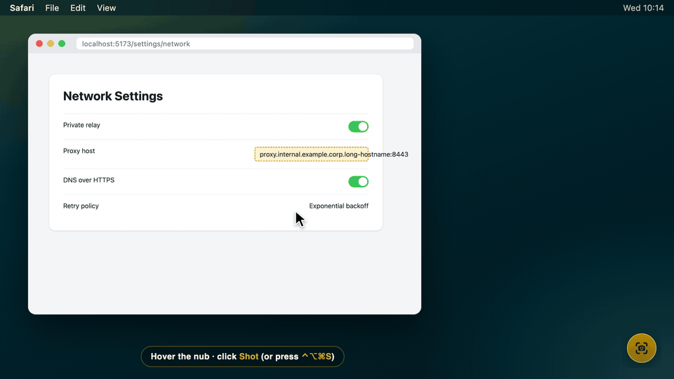
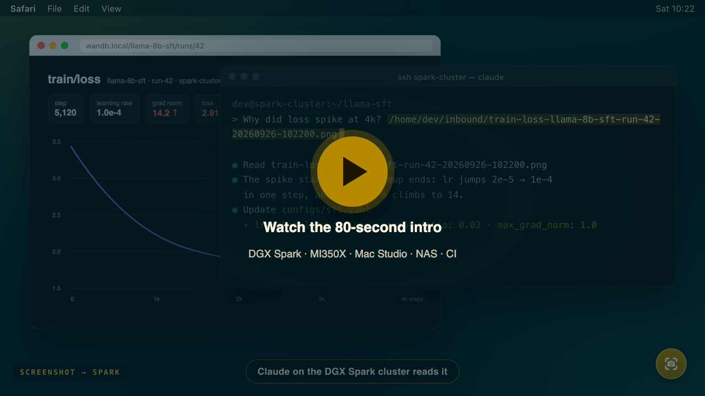
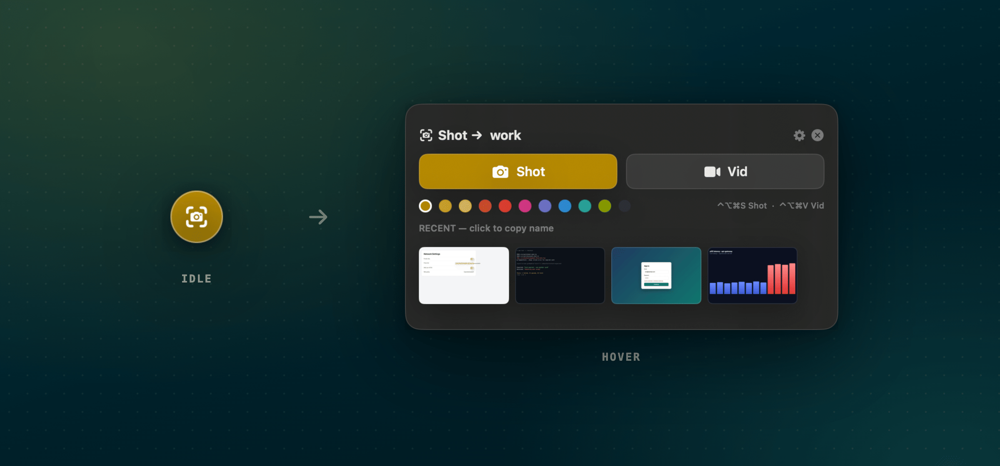
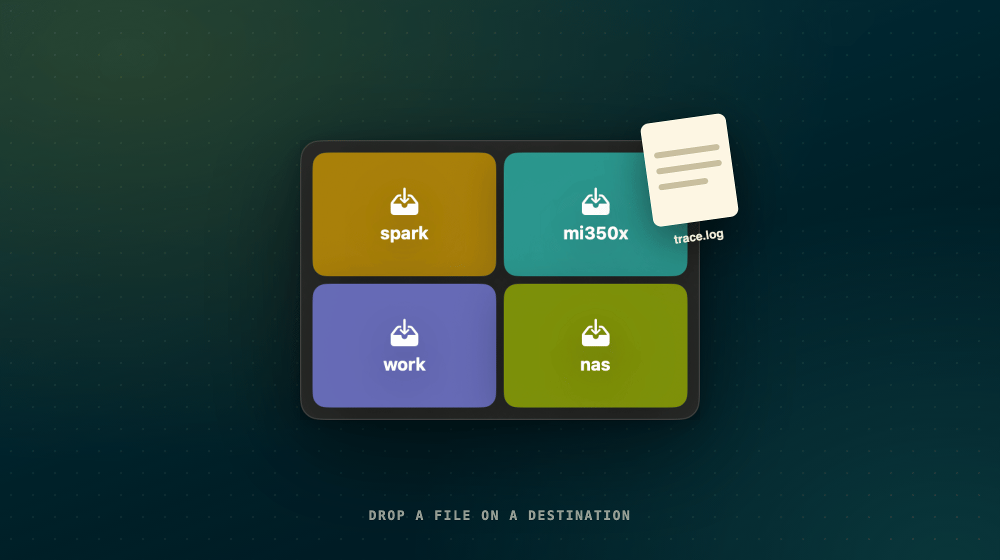
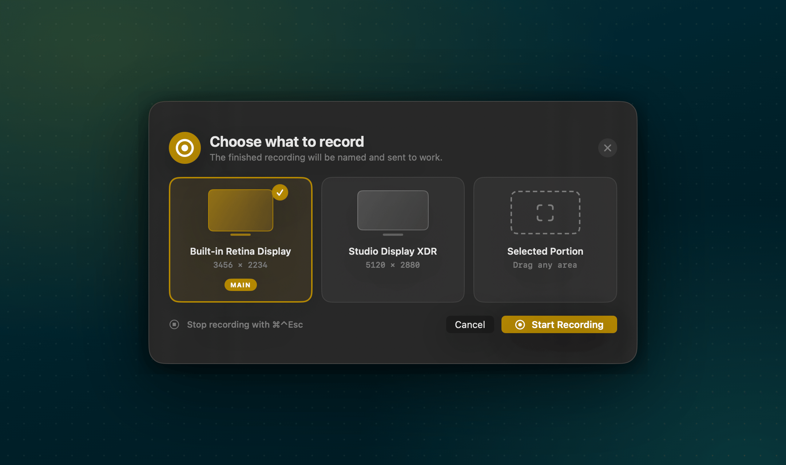
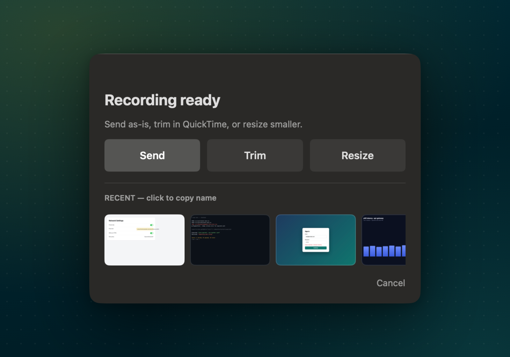
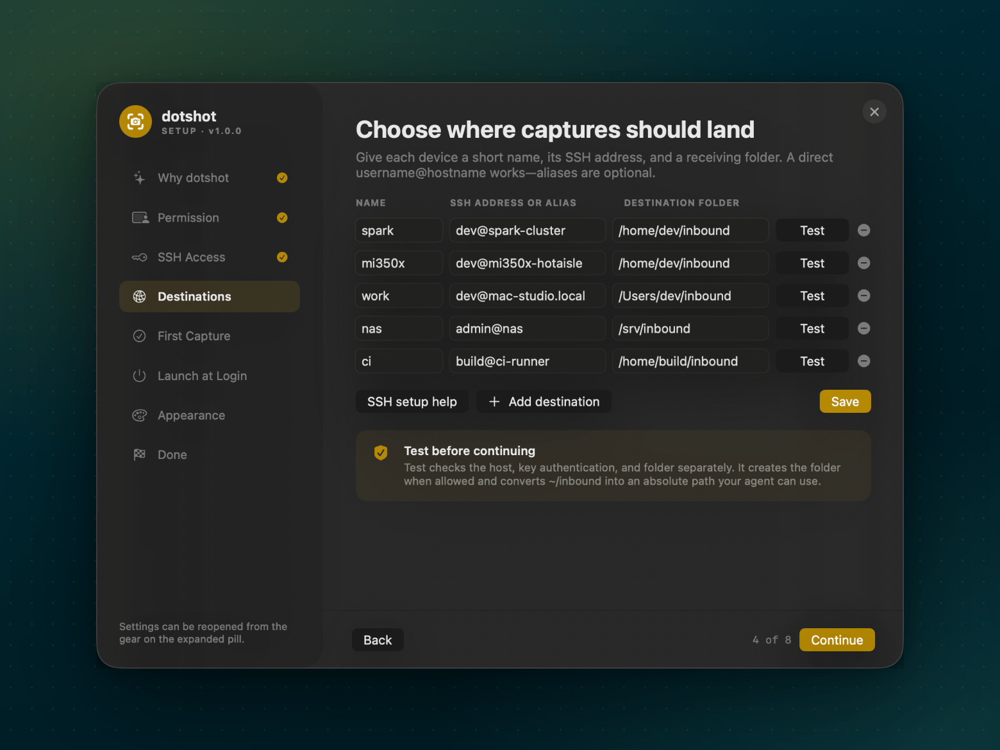
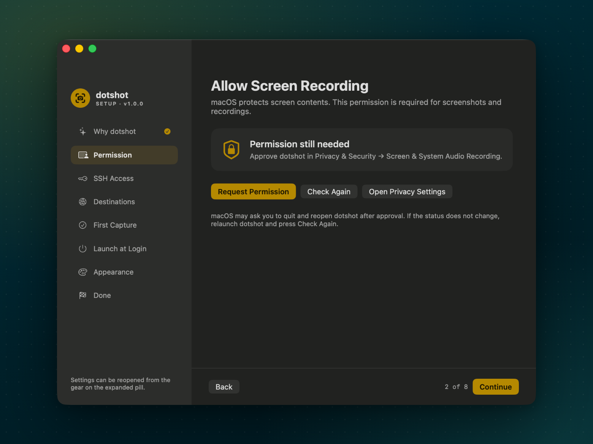
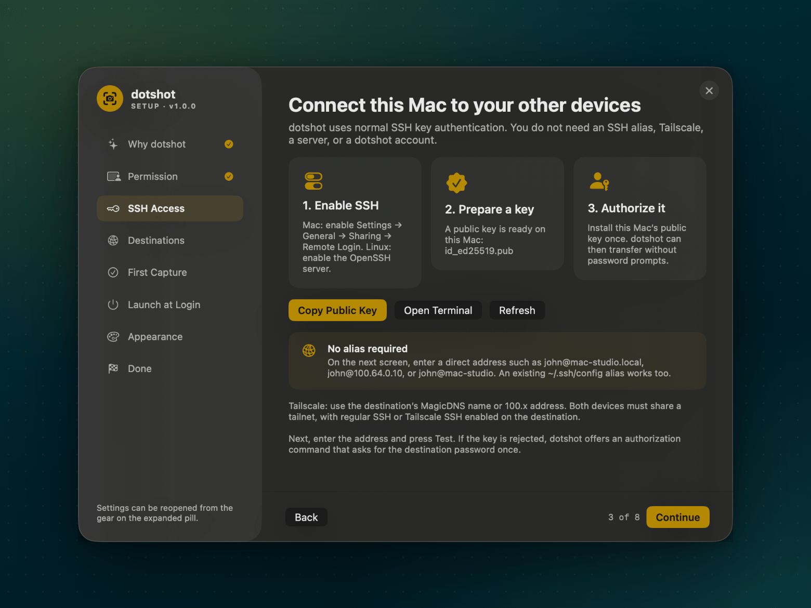
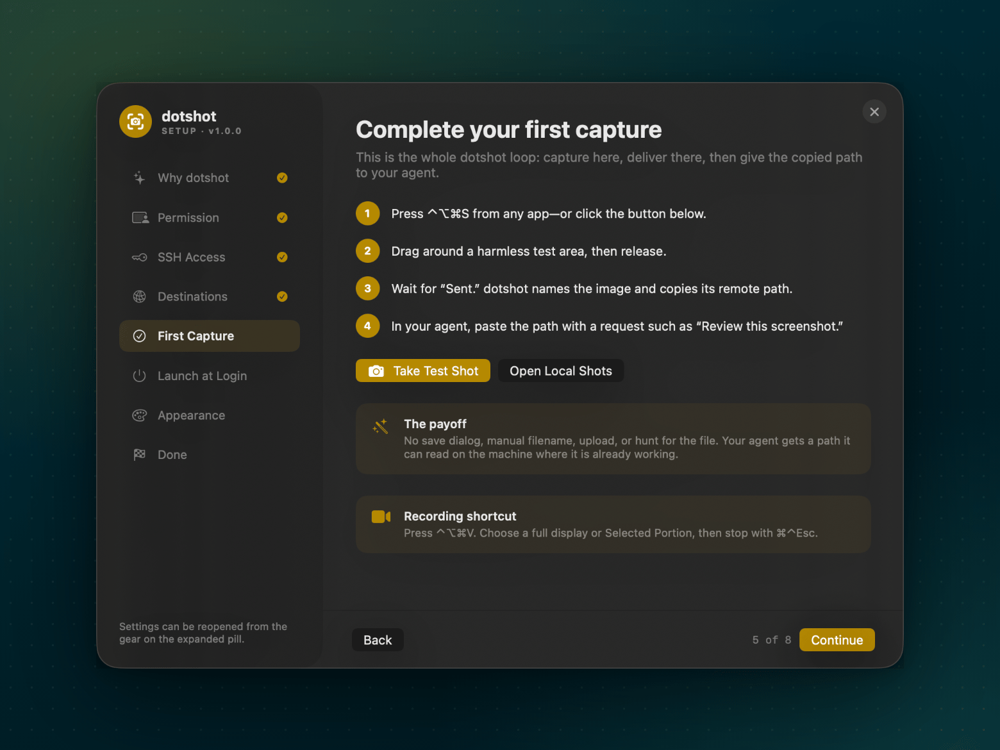

# dotshot

**Capture here. Let your agents use it there.**

dotshot sends screenshots and screen recordings from your Mac straight to the
machine where your coding agent is working, over SSH, and copies the remote path
to your clipboard. Paste that path into Claude Code, Codex, or any terminal
agent.

```text
⌃⌥⌘S → drag over the problem → named, delivered, path copied → paste into your agent
```



There's no save dialog, no file naming, no upload, and no hunting for the file
on the other machine. There's also no account, cloud inbox, receiving service,
telemetry, or API key.

[**Download for macOS**](https://github.com/mejohnc-ft/dotshot/releases/latest) · [**Watch the 80-second intro**](https://mejohnc-ft.github.io/dotshot/#intro) · [Walkthrough](docs/WALKTHROUGH.md) · [Install guide](docs/INSTALL.md) · [SSH setup](docs/SSH_SETUP.md) · [Troubleshooting](docs/TROUBLESHOOTING.md)

## Why

If you code across a laptop, a desktop, a GPU box, a build machine, or a NAS,
your screenshot usually lands on the wrong computer. dotshot turns what you see
into a path the agent can open right away:

```text
Fix the overflow in /Users/dev/inbound/network-settings-proxy-host-20260916-101400.png
```

Files travel over the SSH or Tailscale connection you already have. On the
destination, dotshot needs nothing but a folder the SSH account can write to.

<p align="center">
  <a href="https://mejohnc-ft.github.io/dotshot/#intro"></a>
</p>

## Features

- **Region screenshots** with offline, on-device OCR naming (`payment-form-test-failed-20260916-101300.png`)
- **Recordings** of a full display or a selected area, with send, trim, or resize afterward
- **Several destinations**, including a Mac or Linux machine reachable by `user@host`, a Tailscale name, or an `~/.ssh/config` alias
- **Global shortcuts:** `⌃⌥⌘S` for a screenshot, `⌃⌥⌘V` for a recording
- **Drag and drop:** drop any file on the camera nub, then onto a destination tile
- **Automation URLs** for Shortcuts, Raycast, BetterTouchTool, and scripts
- **Guided setup** that tests each destination, diagnoses SSH problems, and walks you through a first capture
- **Stays out of the way:** a 42 px camera nub in the corner of the screen you choose, excluded from your own screenshots

<table>
  <tr>
    <td width="50%"></td>
    <td width="50%"></td>
  </tr>
  <tr>
    <td align="center"><b>Hover the nub</b> for Shot, Vid, destinations, and recent captures</td>
    <td align="center"><b>Drag any file</b> onto the nub and drop it on a machine</td>
  </tr>
  <tr>
    <td width="50%"></td>
    <td width="50%"></td>
  </tr>
  <tr>
    <td align="center"><b>Record</b> a whole display or any region</td>
    <td align="center"><b>Send, trim, or shrink</b> the recording before it goes</td>
  </tr>
</table>

## Install

**Requirements:** macOS 14 Sonoma or newer (Apple silicon or Intel), plus a Mac or
Linux destination you can SSH into with a key.

1. Download `dotshot-<version>.dmg` from the [latest release](https://github.com/mejohnc-ft/dotshot/releases/latest).
2. Open the DMG and drag **dotshot** to **Applications**.
3. Open dotshot. Setup starts automatically.

Releases are signed with a Developer ID and notarized by Apple, so dotshot opens
like any other downloaded app. To build from source instead, see [Build from source](docs/INSTALL.md#build-from-source).

## Set up in five minutes

Setup walks through each step and can be reopened any time from the gear on the
expanded pill.

1. **Allow Screen Recording** when macOS asks, then relaunch dotshot if prompted.
2. **Make sure SSH works** from this Mac to the destination without a password:
   ```bash
   ssh -o BatchMode=yes you@destination true && echo ready
   ```
   If that fails, setup can copy the key authorization command for you. The
   [SSH setup guide](docs/SSH_SETUP.md) covers Remote Login, keys, and Tailscale.
3. **Add a destination** with a short name (`work`), an SSH address
   (`you@mac-studio.local`), and a folder (`~/inbound`). Press **Test**. dotshot
   checks the host, the key, and the folder separately, creates the folder, and
   saves its absolute path.
4. **Take a first capture** with `⌃⌥⌘S`. Wait for the **Sent** notification, then
   paste the path into your agent.

<p align="center">
  
</p>

<table>
  <tr>
    <td width="33%"></td>
    <td width="33%"></td>
    <td width="33%"></td>
  </tr>
  <tr>
    <td align="center">Permission</td>
    <td align="center">SSH access</td>
    <td align="center">First capture</td>
  </tr>
</table>

Every screen, in order, is in the [walkthrough](docs/WALKTHROUGH.md).

## Use

| Action | How |
| --- | --- |
| Screenshot to the current destination | `⌃⌥⌘S`, or hover the nub and click **Shot** |
| Recording | `⌃⌥⌘V`, or **Vid**, then pick a display or **Selected Portion**. Stop with `⌘⌃Esc`. |
| Switch destination | Click the destination name on the expanded pill |
| Send an existing file | Drag it onto the nub, then onto a destination tile |
| Reopen setup | Gear on the expanded pill, or `open dotshot://settings` |

After a successful transfer, the clipboard holds the absolute remote path. If
the transfer fails, dotshot keeps the file, copies its local path, and logs the
error to `~/Shots/.dotshot.log`.

### Automation URLs

| URL | Effect |
| --- | --- |
| `dotshot://image` | Screenshot to the current destination |
| `dotshot://image?dest=work` | Screenshot to `work` |
| `dotshot://video?dest=work` | Recording picker |
| `dotshot://video?dest=work&screen=2` | Record display 2 |
| `dotshot://video?dest=work&screen=region` | Record a selected area |
| `dotshot://settings` | Open destination settings |
| `dotshot://setup?step=appearance` | Open setup at a step (`welcome`, `permissions`, `connect`, `destinations`, `test`, `login`, `appearance`, `done`) |

```bash
open 'dotshot://image?dest=work'
```

## Where things live

| What | Where |
| --- | --- |
| Local copies of captures | `~/Shots` |
| Delivery log | `~/Shots/.dotshot.log` |
| Destinations | `~/Library/Application Support/dotshot/destinations.tsv` |
| Preferences | `defaults read com.mejohnc.dotshot` |

`destinations.tsv` holds one tab-separated row per destination (name, SSH host
or alias, remote folder). You can edit it by hand. See
[`config/destinations.example.tsv`](config/destinations.example.tsv).

## How it compares

Other tools solve part of this, and one of them may suit you better:

- [clipbridge](https://github.com/skeptrunedev/clipbridge) lets you press Ctrl+V for a clipboard image inside Claude Code or Codex on Linux hosts.
- [clipssh](https://github.com/samuellawrentz/clipssh), [clipport](https://github.com/arihantsethia/clipport), and [claude-screenshot-uploader](https://github.com/mdrzn/claude-screenshot-uploader) upload a clipboard image or screenshot over SSH and copy the remote path. Most support several hosts.
- The VS Code Remote-SSH image-paste extensions do the same inside the editor's terminal.

dotshot goes further than getting an image across: it sends **screen recordings**
and **any file** too, names captures after what's on screen, and lets you pick the
machine per capture from a native pill, drop tiles, or a `dotshot://` URL. Setup
tests each connection and says what to fix. Under the hood it's `screencapture`
plus `scp` on purpose, so nothing new runs on your destinations.

## Privacy and security

dotshot can read the screen only after you grant Screen Recording permission.
Captures are saved locally and sent only to destinations you configure, using
the system `scp` with key authentication. Password prompts are disabled and
host-key checking stays on. dotshot has no analytics, no update service, and no
network access of its own. See [SECURITY.md](SECURITY.md).

## Development

```bash
./scripts/build.sh      # build ~/Applications/dotshot.app and launch it
./scripts/test.sh       # unit tests, capture-script tests, shellcheck
./scripts/release.sh    # universal DMG + ZIP + checksums (see docs/RELEASING.md)
```

See [CONTRIBUTING.md](CONTRIBUTING.md), [docs/QA.md](docs/QA.md), and
[docs/RELEASING.md](docs/RELEASING.md). Screenshots and videos are generated from
the real app by the scripts in `scripts/docs/` (see [Refreshing screenshots and the demo](docs/RELEASING.md#refreshing-screenshots-and-the-demo)).

dotshot was previously called Shot Pill. The first launch of dotshot imports Shot
Pill's settings; see [Migrating from Shot Pill](docs/INSTALL.md#migrating-from-shot-pill).

## License

[MIT](LICENSE)
