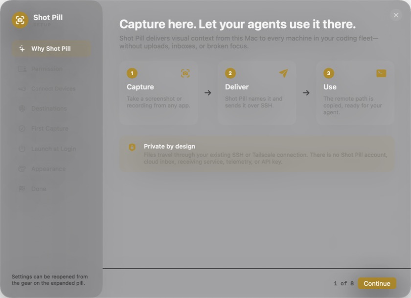

# Shot Pill

**Capture here. Let your agents use it there.**

Shot Pill is visual-context delivery for agentic coding fleets. Capture a
screenshot or recording on your Mac, send it directly to any SSH-connected
machine, and get the remote path on your clipboard—ready for Codex, Claude Code,
or a terminal agent.

```text
⌃⌥⌘S → select an area → image is named and delivered → remote path is copied
```

No save dialog. No manual filename. No upload. No hunt for the file on the
machine where your agent is working.

When idle, Shot Pill is a 42 px camera nub in the corner. Hover to reveal
capture controls, destinations, accent colors, and recent captures.



## Why Shot Pill

If you code across a laptop, desktops, build machines, AI workstations, or a
NAS, the screenshot is often on the wrong computer. Shot Pill turns visual
context into a path that an agent can read immediately:

```text
Review the layout issue in /home/john/inbound/settings-panel-20260726.png
```

Files travel through your existing SSH or Tailscale connection. Shot Pill has
no account, cloud inbox, receiving daemon, telemetry, or API key.

## Highlights

- Region screenshots with offline OCR-based filenames
- Full-display or selected-region recordings
- Multiple named SSH destinations and remote folders
- Global shortcuts: `⌃⌥⌘S` for a screenshot and `⌃⌥⌘V` for recording
- URL actions for Shortcuts, Raycast, BetterTouchTool, and scripts
- Drag files onto the nub to send them
- Native first-run setup, Launch at Login, display/corner placement, and accent selection
- No server, account, API key, analytics, or third-party runtime dependencies

## Requirements

- macOS 13 or newer
- Apple Command Line Tools (`xcode-select --install`)
- A Mac or Linux destination reachable over SSH
- Optional: Tailscale for private device addressing

## Install from source

```bash
git clone https://github.com/mejohnc-ft/shot-pill.git
cd shot-pill
./scripts/install.sh
```

The installer builds `~/Applications/Shot Pill.app` and opens guided setup:

1. See the capture → deliver → use workflow
2. Screen Recording permission
3. Connect destination devices, including beginner SSH guidance
4. Configure and test SSH destinations and writable remote folders
5. Complete a real first capture
6. Approve Launch at Login
7. Choose accent, target display, corner, and inset
8. Review shortcuts and the privacy boundary

Setup can be reopened from the gear on the expanded pill or with:

```bash
open -b com.johnc.shotpill 'shotpill://settings'
```

## Configure destination devices

You do **not** need an SSH alias. Shot Pill accepts:

- `username@hostname.local` on a local network
- `username@100.x.y.z` using a Tailscale IP
- `username@device-name` using Tailscale MagicDNS
- An existing alias from `~/.ssh/config`

The guided setup detects an existing public key, explains how to create or
authorize one, and diagnoses host, authentication, and folder failures
separately. Start with the complete [SSH setup guide](docs/SSH_SETUP.md) if SSH
key authentication is new to you.

Shot Pill never stores SSH passwords or private keys. Its Test button connects
without password prompts, creates the destination folder when allowed, verifies
that it is writable, and resolves `~/inbound` into an absolute path your agent
can use.

During setup, enter:

- **Name:** a short label such as `work`, `nas`, or `ai`
- **SSH address or alias:** normally `username@device`
- **Destination folder:** an absolute path or `~/inbound`

Destination configuration is stored locally at:

```text
~/Library/Application Support/Shot Pill/destinations.tsv
```

It is never included in the repository or app bundle.

## Use

| Action | Shortcut or URL |
| --- | --- |
| Region screenshot | `⌃⌥⌘S` |
| Screen recording picker | `⌃⌥⌘V` |
| Screenshot to current destination | `shotpill://image` |
| Screenshot to a destination | `shotpill://image?dest=work` |
| Recording picker | `shotpill://video?dest=work` |
| Record display 2 directly | `shotpill://video?dest=work&screen=2` |
| Record selected portion | `shotpill://video?dest=work&screen=region` |
| Open settings | `shotpill://settings` |

After a successful transfer, Shot Pill copies the absolute remote path to the clipboard. If transfer fails, it keeps the local file and copies the local path instead.

Local captures and logs live in `~/Shots`.

## Build

```bash
./scripts/build.sh
```

Useful options:

```bash
./scripts/build.sh --no-launch
./scripts/build.sh --adhoc
./scripts/build.sh --app "$PWD/dist/Shot Pill.app" --no-launch
```

The source installer can create a self-signed local code-signing identity. Its purpose is identity stability: macOS Screen Recording approval can survive later local rebuilds. For polished public binary releases, use an Apple Developer ID certificate and notarization instead.

## Privacy and security

Shot Pill can read screen contents only after explicit macOS approval. Captures are saved locally and sent only through the system `scp` command to destinations you configure. It does not collect telemetry or run a receiving service.

Review [SECURITY.md](SECURITY.md) before reporting a sensitive issue.

## Uninstall

```bash
./scripts/uninstall.sh
```

The uninstaller moves the app to Trash and leaves settings and captures in place.

## Contributing

See [CONTRIBUTING.md](CONTRIBUTING.md). Shot Pill is available under the [MIT License](LICENSE).
