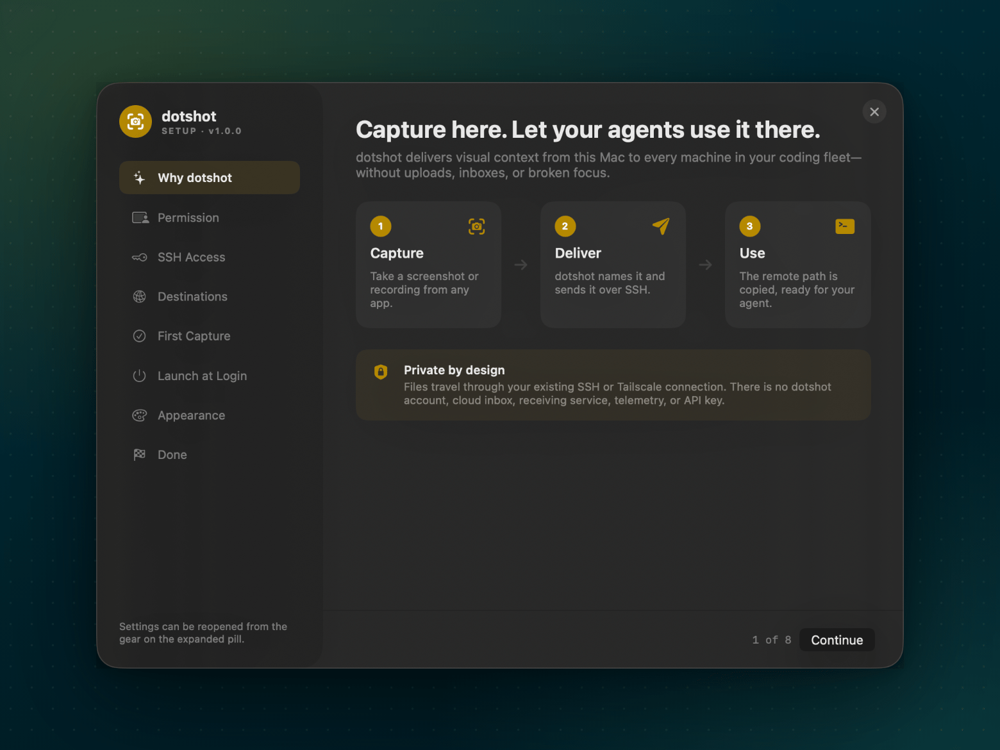
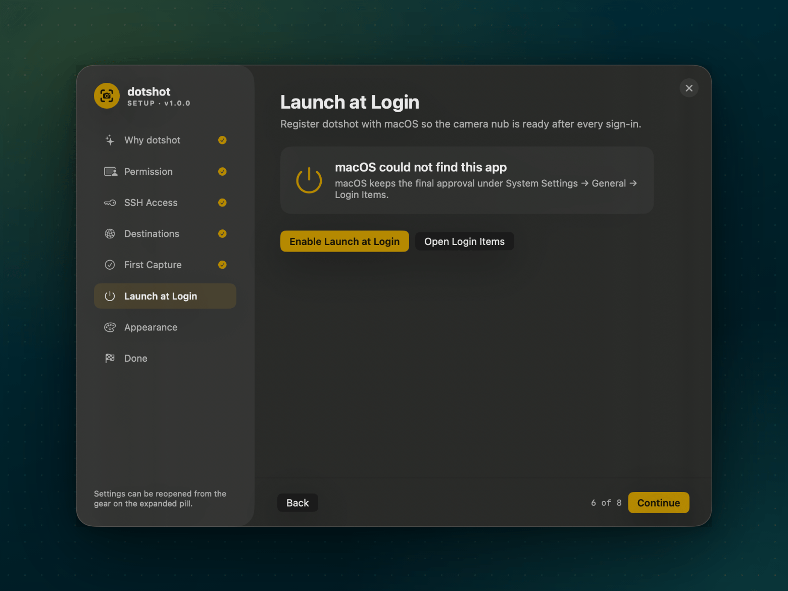
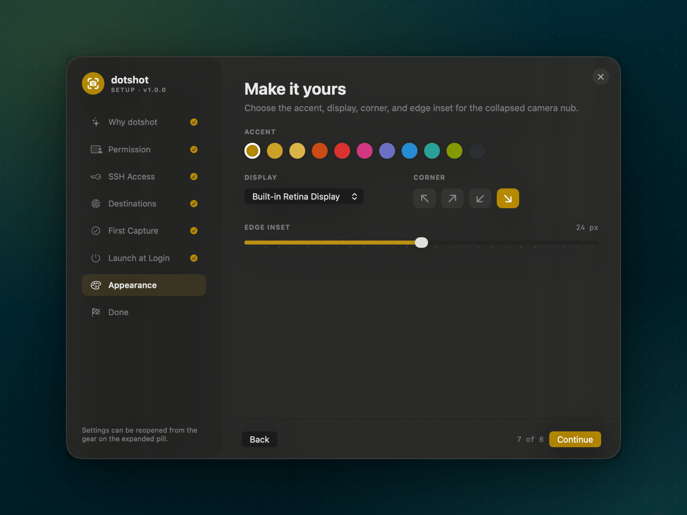
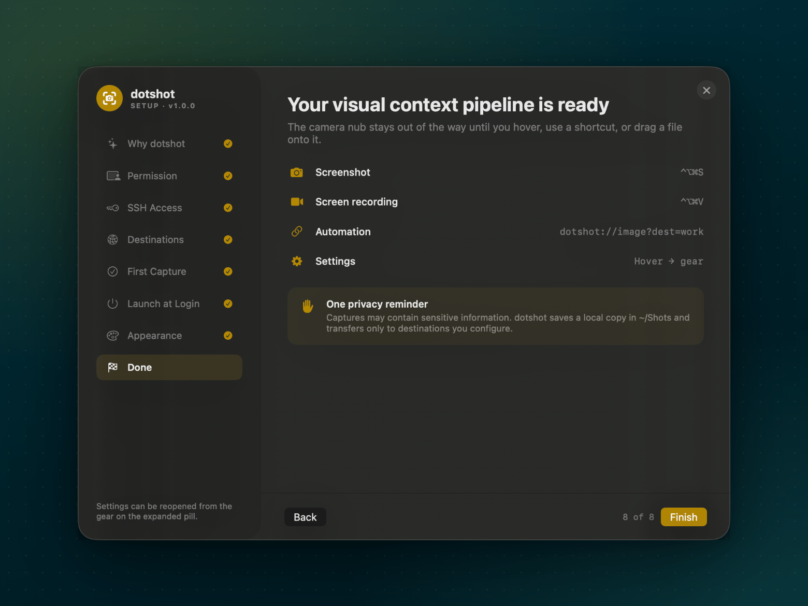

# A tour of dotshot

Every screen you'll see, in the order you'll see it. For the short version, watch
the [80-second intro](images/intro.mp4) or read the [README](../README.md).

- [Setup](#setup)
- [Everyday use](#everyday-use)
- [When something goes wrong](#when-something-goes-wrong)

## Setup

Setup opens the first time you launch dotshot. You can reopen it later from the
gear on the expanded pill or with `open 'dotshot://settings'`.

### 1. Why dotshot



A one-screen summary of what dotshot does: capture on this Mac, deliver over
SSH, and paste the remote path into your agent.

### 2. Permission


dotshot needs **Screen Recording** permission to capture anything. Click
**Request Permission** (or **Open Privacy Settings**) and turn dotshot on under **System Settings → Privacy &
Security → Screen & System Audio Recording**. macOS usually asks you to quit and
reopen the app. Then click **Check Again**.

dotshot doesn't need Accessibility permission. The global shortcuts work without it.

### 3. SSH Access


Each destination needs an SSH server and this Mac's key:

- **Mac destination:** System Settings → General → Sharing → **Remote Login**.
- **Linux destination:** install and start OpenSSH (for example, `sudo apt install openssh-server`).
- **No key yet?** **Copy Key Creation Command** copies an `ssh-keygen -t ed25519` command; **Open Terminal** gives you somewhere to run it, and **Refresh** picks up the new key.
- **Authorize it:** run `ssh-copy-id you@host` once. If the key is rejected, the Destinations step offers the exact command. **Copy Public Key** copies the key itself for pasting into `~/.ssh/authorized_keys`.

The [SSH setup guide](SSH_SETUP.md) covers Tailscale, `~/.ssh/config` aliases,
and common errors.

### 4. Destinations


Add one row per machine:

| Field | Example | Notes |
| --- | --- | --- |
| Name | `gpu` | One word. It appears on the pill, in notifications, and in `dotshot://…?dest=gpu`. |
| SSH address or alias | `dev@gpu-box`, `gpu-box.tailnet.ts.net`, `100.101.102.103`, `gpu` | Anything `ssh` on this Mac can reach without a password |
| Destination folder | `~/inbound` | Created if needed. Saved as an absolute path after a passing test. |

**Test** checks the host, the key, and the folder separately and tells you which
one failed and how to fix it. It creates the folder private to your account, refuses
folders other accounts can write to, and warns if other accounts can read it. Use a
folder of its own, not your home folder. The first time through, at least one destination
has to pass before you can continue.

### 5. First Capture


Press `⌃⌥⌘S` (or **Take Test Shot**), drag over something harmless, and wait for
**Sent**. The remote path is now on your clipboard. Paste it into your agent with
a request such as "Describe this screenshot" to check the whole loop.

### 6. Launch at Login



Optional. If macOS says approval is required, turn dotshot on under **System
Settings → General → Login Items**.

### 7. Appearance



Pick the accent color, the display, the corner, and how far from the edge the
nub sits. Changes apply immediately.

### 8. Done



A recap of the shortcuts and automation URLs.

## Everyday use

### The nub and the pill


dotshot idles as a 42 px camera nub. Hover it to open the pill:

- **Shot** and **Vid** capture to the destination shown after the arrow (`Shot → work`).
- Click the destination name to switch machines.
- The colored dots change the accent.
- **Recent** thumbnails copy a capture's file name when clicked.
- The gear opens setup; × quits.

The nub and pill never appear in your own screenshots or recordings.

### Screenshots

`⌃⌥⌘S`, drag over an area, release. dotshot then:

1. Names the file from on-screen text using Apple's on-device OCR, for example `payment-form-test-failed-20260916-101300.png`
2. Keeps a copy in `~/Shots`
3. Sends it with `scp` to the destination folder
4. Puts the absolute remote path on your clipboard and shows **Sent to &lt;destination&gt;**

Press Esc during the selection to cancel. Nothing is saved or sent.

### Recordings


`⌃⌥⌘V` opens the picker: any connected display, or **Selected Portion** to drag
out an area. Stop with `⌘⌃Esc`.


When you stop, choose:

- **Send** delivers the recording as it is.
- **Trim** opens a trim window: drag the yellow handles, then click **Trim** to send the kept part. **Cancel** keeps the recording without sending it.
- **Resize** shrinks it to 1280×720 before sending.
- **Cancel** keeps it in `~/Shots` without sending.

### Any file, any machine


Drag any file onto the nub. It turns into one tile per destination (up to six);
drop the file on a tile to send it there. The file arrives under a safe name with a
timestamp, such as `eval-results-run-42-20260926-103400.parquet`, so the path pastes
cleanly into a prompt and never replaces an earlier file. Folders and links aren't sent.

### Automation

Everything the pill does is also a URL, so you can trigger it from Shortcuts,
Raycast, BetterTouchTool, a Stream Deck, or a script:

```bash
open 'dotshot://image?dest=gpu'              # screenshot to gpu
open 'dotshot://video?dest=work&screen=2'    # record display 2, send to work
open 'dotshot://video?screen=region'         # record a region, current destination
```

The full list is in the [README](../README.md#automation-urls).

## When something goes wrong

If a transfer fails, dotshot keeps the file in `~/Shots`, copies the **local**
path instead, and shows **Saved locally — send to &lt;destination&gt; failed**.
Details go to `~/Shots/.dotshot.log`. Transfers never wait for a password and
give up after 10 seconds.

[TROUBLESHOOTING.md](TROUBLESHOOTING.md) covers blank captures, permission
resets, host-key errors, and more.
